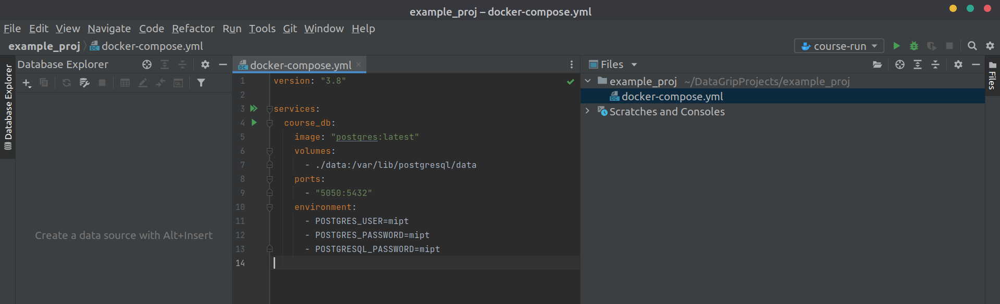
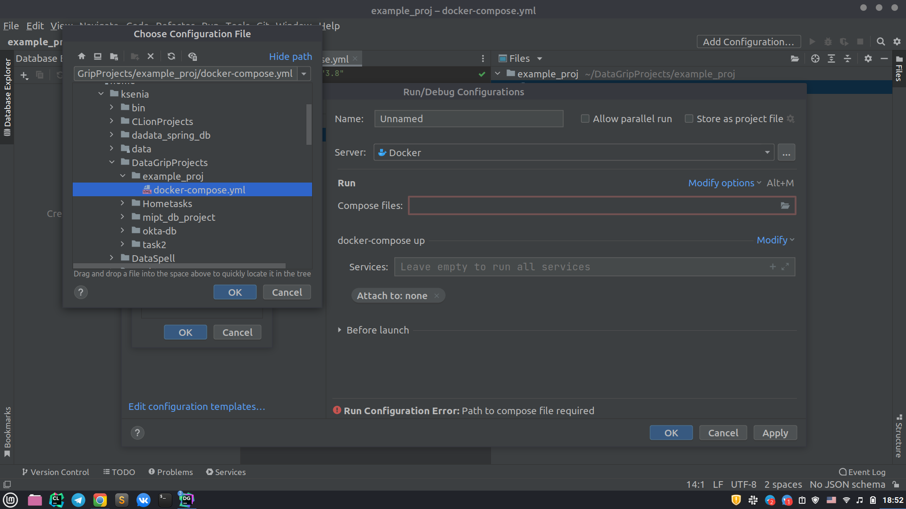
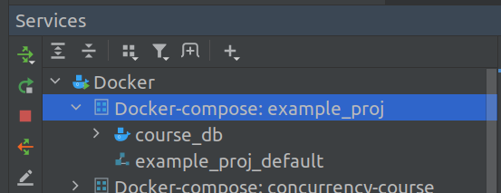
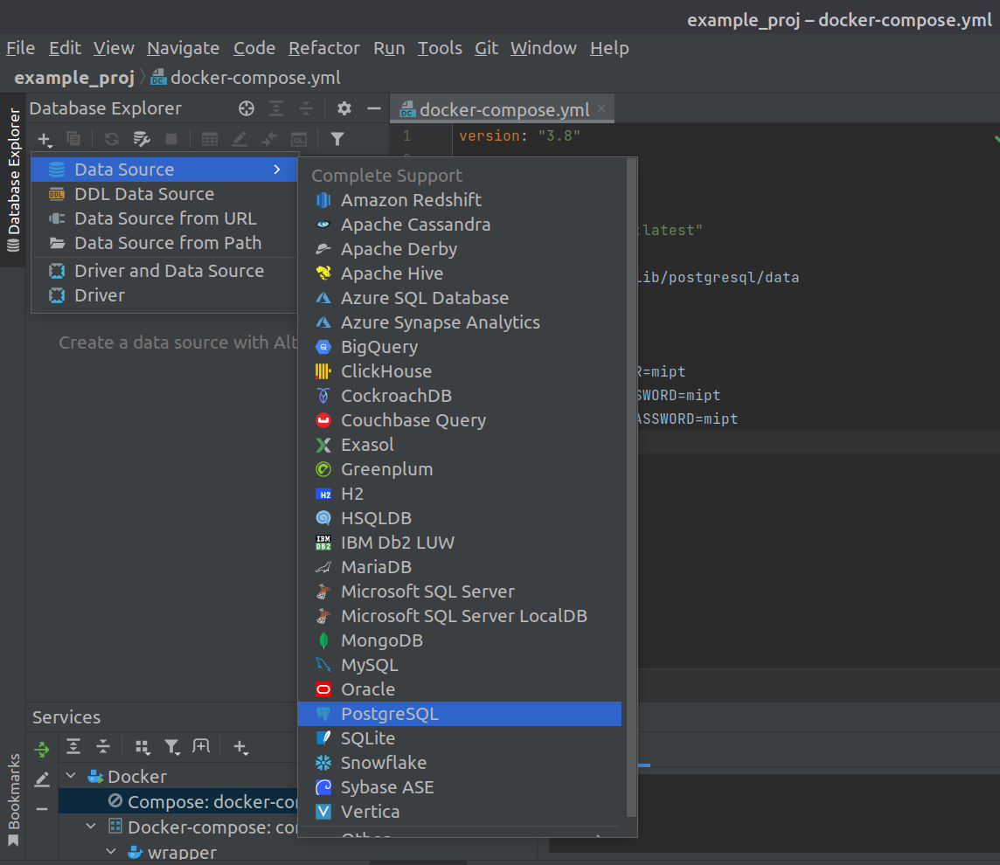
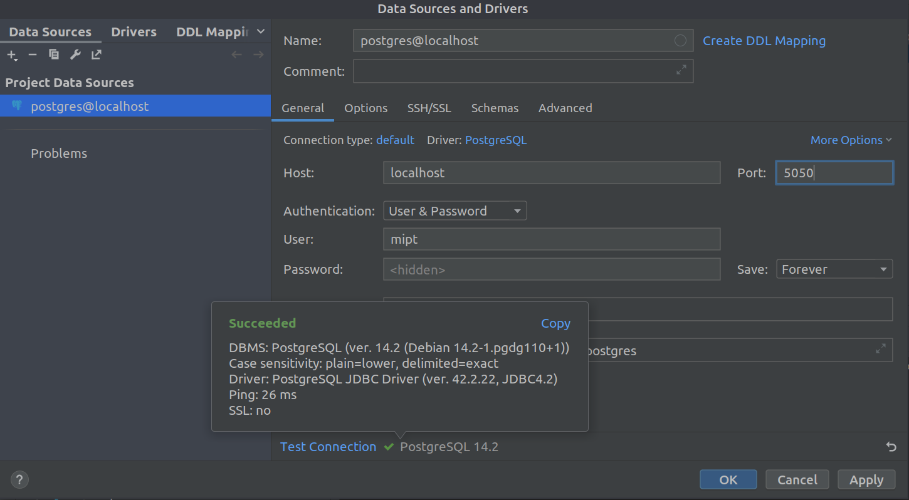
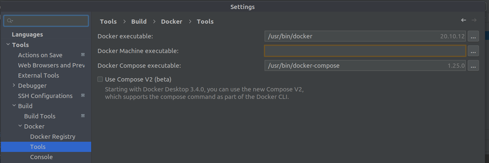
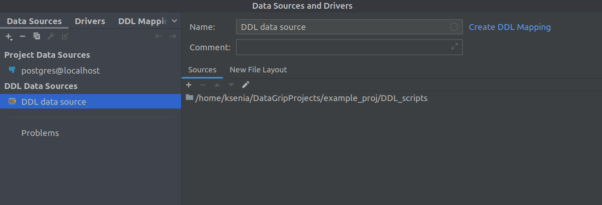
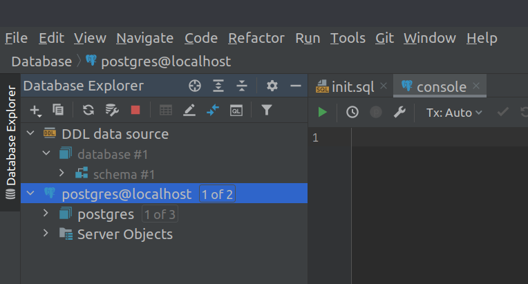
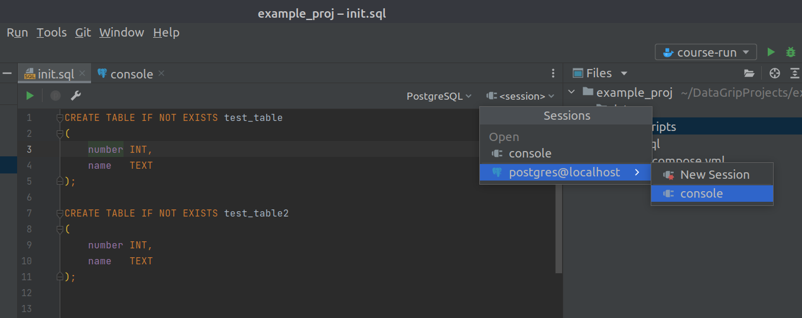
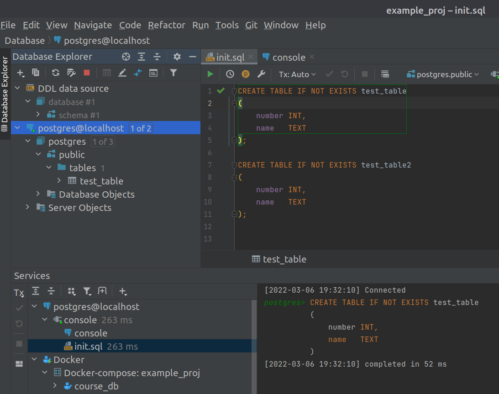

1. Создайте проект, далее добавьте в папку проекта файл ```docker-compose.yml```, в который вставьте следующее содержимое:
```
    version: "3.8"
    
    services:
      course_db:
        image: "postgres:latest"
        volumes:
          - ./data:/var/lib/postgresql/data
        ports:
          - "5050:5432"
        environment:
          - POSTGRES_USER=mipt
          - POSTGRES_PASSWORD=mipt
          - POSTGRESQL_PASSWORD=mipt
```

Должно получиться вот так:




2. Далее настроим профиль сборки: тыкнем в Add Configuration (см.скрин) и в compose files добавим файл из предыдущего шана:


Теперь профиль сборки по зелёной стрелочке будет запускать ```docker-compose up``` и в IDE можно будет перезапускать сервисы. Чтобы завершить работу docker-compose, можно тыкнуть на красный квадратик в меню контейнеров:



3. По зелёной стрелочке запустим стартуем сервис, далее подключаемся к контейнеру:


4. Вводим настройки из ```docker-compose.yml``` и проверяем соединение. Жмакаем на apply



5. В случае проблем с запуском, стоит обратить внимание на то, чтобы в среде всё было ок с данными настройками:




6. В проекте создадим папку со скриптами и добавим её в структуру проекта как источник DDL


Должно получиться так:


8. Далее сделаем консоль для запуска скриптов:


10. Победа:


